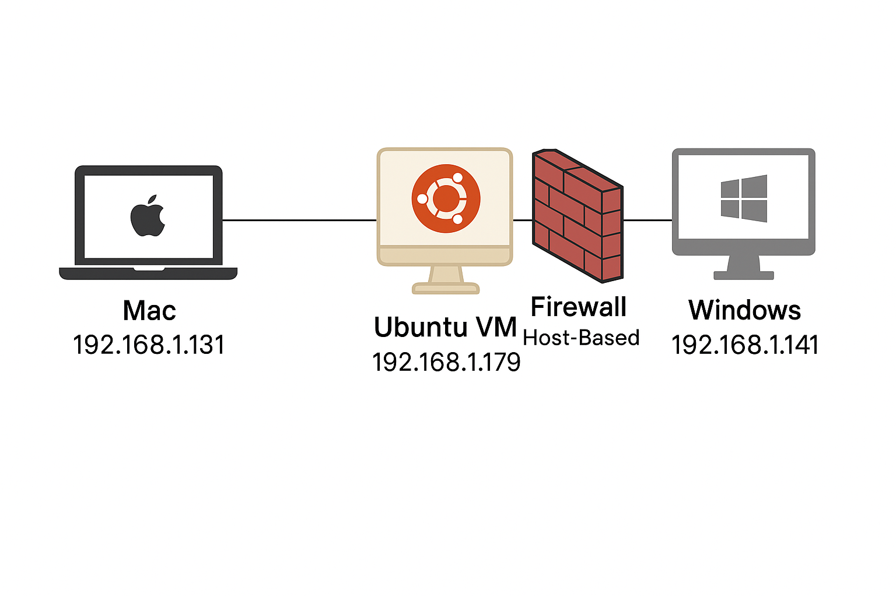

# 🔥 UFW Firewall Simulation Lab

This project demonstrates how to configure and test a firewall using UFW (Uncomplicated Firewall) on a Linux virtual machine. The goal is to simulate real-world traffic filtering scenarios and show how UFW can enforce network security through stateful rules.

---

## 🧠 Objectives

- Understand the difference between firewalls and ACLs (Access Control Lists)
- Implement security policies to control inbound and outbound traffic
- Use UFW to allow or deny connections based on IP, port, and protocol
- Demonstrate how stateful firewalls can remember connection context
- Block access to unwanted websites via IP-based rules

---

## 🛠️ Tools and Technologies

- UFW (iptables frontend)
- Ubuntu 22.04 (Virtual Machine)
- Apache2 (to simulate a web server)
- SSH (remote terminal access)
- dig, curl, ping (for DNS/IP and connection tests)
- Optional: PuTTY (SSH client on Windows)

---

## 🖥️ Lab Setup

The environment simulates a home network where:

- An Ubuntu VM (`192.168.1.179` private IPv4) is used as a secure internal server, where UFW (Uncomplicated Firewall) is configured and tested.
- Two host machines (Mac and Windows) act as external clients.
  - Mac: `192.168.1.131`
  - Windows: `192.168.1.141`
- Bridge mode is enabled on one of the hosts so that all devices are connected to the same local network.
- The firewall acts as a **host-based firewall** protecting only the Ubuntu VM.

### 🖼️ Network Diagram



---

## 🔐 Firewall Rules Implemented

```bash
# Default policy
sudo ufw default deny incoming
sudo ufw default allow outgoing

# Allow SSH only from my Windows personal device
sudo ufw allow from 192.168.1.141 to any port 22 proto tcp comment 'Allow SSH from my Windows'

# Allow HTTP only from my Mac personal device
sudo ufw allow from 192.168.1.131 to any port 80 proto tcp comment 'Allow HTTP from my Mac'

# Block outgoing access to gambling websites
sudo ufw deny out to 5.226.179.10 comment 'Block bet365 access'
```

⚠️ **Be careful!**  
If you want to copy and use these commands on your own personal VM, keep in mind that your devices will have different private IP addresses configured.  
Make sure to adjust the IPs in the firewall rules accordingly.

There's no need to copy these rules if you don't want to. It's just an applicable example.

---

## 📁 Folder: `explanations/`

This folder contains supporting documents that explain:

- Why ICMP (ping) requests may still work despite using `default deny incoming` in UFW
- The practical and conceptual differences between ACLs and firewalls
- Additional insights into protocol-specific behaviors with UFW

These documents are written to consolidate theoretical understanding with practical observations from the lab.

---

## 📸 Screenshots

You can find visual evidence of all connection attempts and rule enforcement in the [`screenshots/`](screenshots) folder.  
It includes examples of:

- Successful and blocked HTTP access
- SSH requests
- Ping behavior
- Script execution

---

## ✅ Conclusion

This lab provides hands-on experience in configuring a basic but effective firewall using UFW.  
It demonstrates how host-based firewalls can provide secure, stateful control over network traffic and helps reinforce foundational network security concepts.
